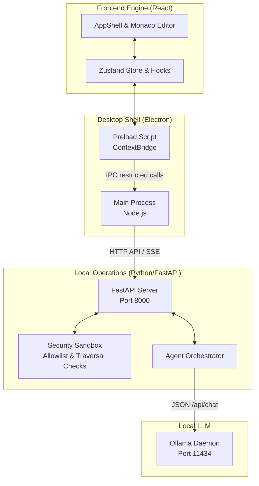

# LocalGravity


**LocalGravity** is a modern, privacy-first agentic IDE designed to put the power of a large language model directly on your local machine. No cloud APIs, no subscription fees, no telemetry, and zero network exfiltration risk. It combines the robust editor experience of Monaco (VS Code) with an isolated Python/FastAPI backend and a strictly sandboxed Electron shell.

## Philosophy
In a world increasingly dependent on cloud-hosted AI, your proprietary source code is often sent across the internet to third parties. **LocalGravity** is built on the belief that developers should have access to state-of-the-art coding agents without sacrificing privacy or granting untrusted internet access to their workspace.

1. **Local-First:** All reasoning remains on-device using [Ollama](https://ollama.ai).
2. **Security-First:** The Electron shell is explicitly locked down. It refuses to load remote content, blocks Node integration in renderers, and strictly moderates IPC. 
3. **Transparent Execution:** The AI cannot silently execute commands. All terminal operations and file actions are sandboxed, allowlisted, and require oversight.

---

## Architecture

At its core, LocalGravity is structured as a 3-tier application, strictly separating the generic web UI from the privileged system APIs.



- **Frontend:** Provides the rich, reactive editor interface. Hosted as a Vite app.
- **Desktop Shell:** Manages the window lifecycle and proxies strictly-typed IPC requests to the backend.
- **Backend:** Executes Python business logic, handles terminal execution safely without `shell=True`, and queries the local LLM.

---

## Prerequisites

Before building or running LocalGravity, ensure your machine meets the following requirements:

- **Node.js** v20.0.0 or higher
- **Python** v3.12 or higher
- **Ollama** installed and running (`ollama serve`). [Download Ollama here.](https://ollama.ai/download)
- **Git**

---

## Setup Instructions

### 1. Model Preparation
Before running the IDE, pull the specific Ollama model that powers LocalGravity.

```bash
ollama pull gpt-oss:20b
```

### 2. Clone the Repository
```bash
git clone https://github.com/Yousuf-36/Local-gravity.git
cd Local-gravity
```

### 3. Initialize the Backend
Set up your Python virtual environment and install the locked dependencies.

```bash
cd backend
python -m venv .venv

# On Windows:
.venv\Scripts\activate
# On macOS/Linux:
source .venv/bin/activate

pip install -r requirements.txt
cd ..
```

### 4. Setup the Frontend and Shell
Copy the local environment template and install the NPM ecosystem.

```bash
cp .env.example .env
npm run install:all
```

### 5. Launch
Start the complete stack spanning React, Vite, FastAPI, and Electron using the provided concurrently script.

```bash
npm run dev
```

---

## Adding New Ollama Models

LocalGravity maintains a strict allowlist of permitted LLM models to ensure reliability and compatibility with the expected JSON/SSE stream formats. 

To add a new model:
1. Download it via ollama: `ollama pull <model-name>`
2. Open `backend/constants.py`.
3. Locate the `ALLOWED_MODELS` set and add your model name:
   ```python
   ALLOWED_MODELS: Set[str] = {"gpt-oss:20b", "llama3", "<model-name>"}
   ```
4. Restart the backend to apply your changes.

---

## Security Model

Because LocalGravity processes arbitrary strings generated by an LLM, its security model assumes the agent could turn malicious (e.g., via prompt injection) and attempts to sandbox consequence-heavy actions.

**Electron Mitigations:**
- `contextIsolation: true` & `nodeIntegration: false` in all `BrowserWindow` instances.
- Sandboxed renderers via `sandbox: true`.
- Zero raw HTML rendering (`DOMPurify` is used strictly on marked output).

**Network Mitigations:**
- CSP header restricts external network access (`connect-src` locked to localhost).
- `app.on('web-contents-created')` intercepts and blocks any external `will-navigate` actions.

**File System & Execution Mitigations:**
- Input validation at the HTTP boundary via Pydantic validators blocks path traversal sequences (e.g. `../`).
- Terminal commands bypass shell interpreters (`shell=False` via `asyncio.create_subprocess_exec`).
- A hardcoded `DENYLIST` explicitly blocks dangerous shell executables (`rm`, `wget`, `curl`, `sudo`).

---

## Contribution Guidelines

We welcome pull requests for bug fixes, efficiency optimizations, and architectural enhancements! 

When contributing, please ensure:
- Your code maintains the existing strict separation of concerns over monolithic structures.
- TypeScript code relies on rigid types (no `any`).
- Python code includes comprehensive type hints and module docstrings.
- Python logic utilizes the centralized logger (`backend/logging_config.py`).
- Security surfaces (IPC definitions, Terminal execution boundaries) require explicit review and exhaustive testing.

---

## License

This project is licensed under the MIT License - see the LICENSE file for details.
